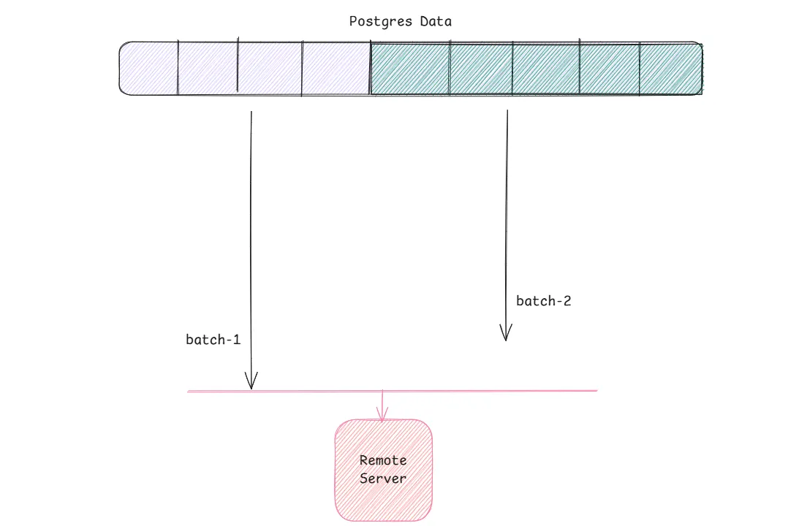
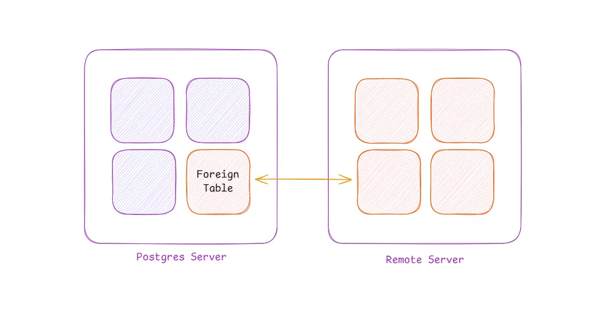

The requirement seems simple: you have a database server and you need to move a subset of its data to another server. In practice, the task is complex — there can be failures on individual rows, data duplication, retry logic, performance bottlenecks, and costs to consider.

We cover some common ways to handle this. Though the blog focuses primarily on PostgreSQL, the same concepts can be extended to a broader range of databases.

## **Batching**



Think of your data as an array. Batching is like a sliding window over that array — you send data in smaller chunks rather than all at once. There are a few common ways to partition data.

The first approach is **offset-based batching**. While straightforward, it can become problematic as data grows: PostgreSQL still reads all preceding rows regardless of which batch you are processing. Worse, if a new row is inserted between Batch 1 and Batch 2, your “page” shifts, causing you to duplicate or skip a row.

```sql
-- Batch 1
SELECT * FROM orders ORDER BY created_at DESC LIMIT 100 OFFSET 0;

-- Batch 2
SELECT * FROM orders ORDER BY created_at DESC LIMIT 100 OFFSET 100;
```

A better option is **key-based** batching. No rows inserted in between batches would be skipped or duplicated. Also note that we omit the OFFSET entirely, so PostgreSQL won’t re-read all the rows before a given key — this saves a lot of time. Crucially, the ORDER BY query is only run against an indexed column where data is already sorted. If the same query is run against a non-indexed column, it would have severe performance consequences. Key-based batching is one of the most widely used approaches.

```sql
-- Batch 1: Get the initial set
SELECT * FROM orders ORDER BY id ASC LIMIT 100;
-- Record the last ID from this batch (e.g., last_id = 100)

-- Batch 2: Start exactly where you left off
SELECT * FROM orders WHERE id > 100 ORDER BY id ASC LIMIT 100;
-- Record the next last_id (e.g., last_id = 200)
```

A third option is **time-based batching**, which uses timestamps to partition data. This is well-suited for scheduled reporting jobs — for example, “how many orders were placed in the last hour” — or pipelines that ship data to an analytics server every few hours.

```sql
-- Batch for a specific hour
SELECT * FROM orders 
WHERE created_at >= '2026-03-04 10:00:00' 
  AND created_at < '2026-03-04 11:00:00'
ORDER BY created_at ASC;
```

However, timestamps are a well-known source of subtle bugs in distributed systems. Even on a single server under high write load, multiple rows can share the same timestamp, making timestamp-based partitioning unreliable on its own.

Once you have chosen how to split your data, the next step is feeding those batches into a pipeline — commonly known as an ETL (or ELT).

## Extract-Transform-Load (ETL)

**Extraction **is capturing data. It could be a batch of data from a database, web scraped content, ERP systems, emails or any other unstructured format or structured format. **Transformation** converts the raw data into a useful format. This can include filtering, deduplication, encryption, column addition or removal, type conversions, and general data cleaning. The last step is to load or “dump” them somewhere. The destination is usually a data lake, warehouse or a lake-house. This is the domain of OLAP (analytical databases), where the goal is to generate summaries, reports and capture insights useful for directing business decisions. ETL pipelines also underpin machine learning workflows, fraud detection, and forecasting

There exists another architecture called ELT which is similar to an ETL in the meaning of terms. But they serve different purposes. An ELT loads the data first and then transforms it. This is useful in machine learning algorithms on the raw inputs. ELTs usually write data to data lakes whereas ETLs load data into data warehouses. For ELTs, both the raw and refined data exists on the same platform, organised into bronze, silver and gold layers. You can read more about ELT or ETL on [*IBM’s docs*](https://www.ibm.com/think/topics/elt).

Common tooling in this space includes: **Airbyte**, **Fivetran**, and **Apache Kafka** for ingestion; **Apache Spark** and **Databricks** for transformation (cleaning, deduplication, joins, and parallel processing). For storage, popular data warehouses include **Snowflake**, **Google BigQuery**, and **Amazon Redshift**; major data lake solutions include **AWS S3** and **Apache Hadoop.**

## Change Data Capture (CDC)

A CDC is usually seen in contrast to ETL. A data pipeline moves data in batches and via jobs, this means the data fetched is somewhat stale. A change data capture system captures and streams changes in real time. The difference is analogous to HTTP polling versus WebSockets. ETL “polls” or queries for a batch of data, whereas a CDC “pushes” pieces of data.

CDCs can work in primarily two different ways. One is Trigger based while other is Log-based. **Trigger based** systems, trigger a piece of code execution whenever there are changes (INSERT/UPDATE/DELETE) made to a table. However too many triggers can incur a noticeable performance overhead.

**Log-based CDC** monitors the database’s Write-Ahead Log (WAL) — also called a transaction log — which records every change made to the database. As soon as a new entry appears in the WAL, the CDC tool streams that event to the target system. This approach has minimal impact on database performance and is the preferred method at scale.

Most production CDC systems pair the log reader with a message queue. Debezium, for example, reads from the WAL and publishes events to Apache Kafka; downstream consumers (such as data warehouses) then read from the Kafka topic. Other widely used tools in this space include Airbyte (which wraps Debezium) and AWS DMS. Look up to [*this video*](https://www.youtube.com/watch?v=6VbRlQ0rL3I) for a deeper dive into Debezium or read [*Airbyte’s blog*](https://airbyte.com/blog/change-data-capture-definition-methods-and-benefits) for more.

## Foreign Data Wrappers (FDWs)

An in-built way to handle data flow in PostgreSQL. With FDWs you can treat tables stored on other servers or even other database engines as if they were locally stored tables.



Before we look at the creation process, let us look at a simple query :

```sql
SELECT * FROM foreign_app.users WHERE name = 'Alice';
```

The “foreign_app” could be a different postgreSQL server, a S3 bucket, ElasticSearch, MongoDB or anything else. Yet, the way we wrote the query felt like looking up a local table. One key distinction from other ways of integration we have discussed so far is that a FDW does *NOT* pull copy data from remote sources. They establish a live connection, so queries always reflect the latest state of the foreign source. This removes the need to set up a full pipeline just to run a query against a few thousand rows.

That said, FDWs are not a replacement for ETL pipelines. They have several notable limitations. Wrappers are not as feature rich as any custom data pipeline. Firstly, FDWs run on memory, so if you try to query a million rows other queries on your main database might be affected. Another major drawback to wrappers : they don’t come with a retry mechanism. If a few rows fail due to random network blips, the entire query would fail. The third drawback to them is they can’t detect schema changes. Addition or removal of columns and tables must be handled manually.

Setting up an FDW involves three steps: (1) create a connection to the foreign server in a dedicated schema to avoid naming conflicts, (2) provide user credentials for authentication, and (3) define a proxy table that maps only the required columns. You can look up here for the code:* *[*ThoughtBot’s blog*](https://thoughtbot.com/blog/postgres-foreign-data-wrapper)*.* You can also read some more examples on [*Supabase’s intro to FDWs*](https://supabase.com/docs/guides/database/extensions/wrappers/overview).

## Conclusion

This post covered several of the most common approaches to moving data from point A to point B: batching, ETL, ELT, CDC, and FDWs. However, these are not all. As I was writing this blog I got to hear about half a dozen new concepts— data virtualization, data mesh, replication for backups and a few more. If any of these caught your interest, they’re worth digging into further.

Thanks for reading, see you soon on the other side of knowledge :)
