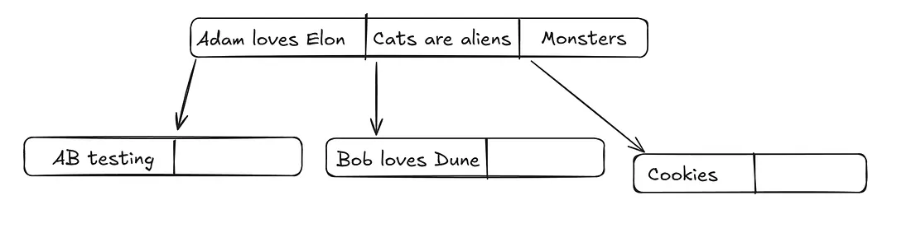
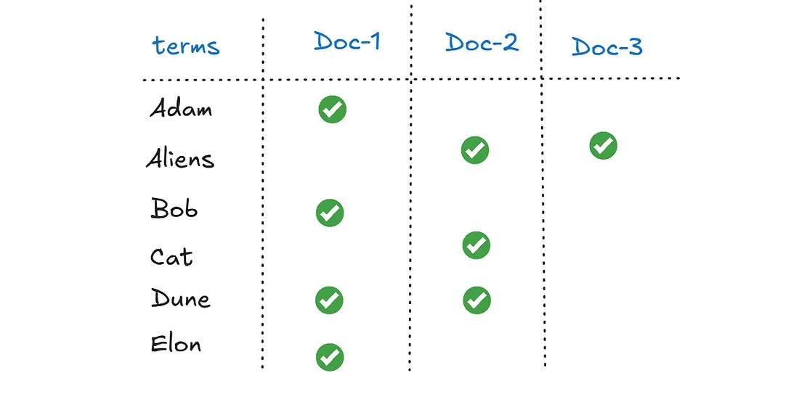
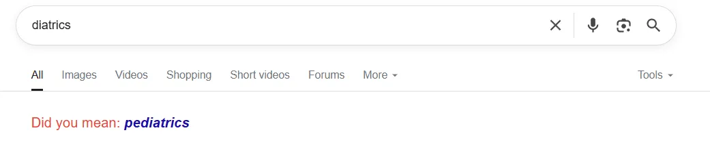

Ever wondered how search engines work ? How food delivery apps provide you with all the similar dishes that you search for ? Ever wondered about all that goes in finding out your favourite memes on Twitter ?

## But Why Elasticsearch ?

Imagine having a blog website, with some thousands of users. On a random day, a user visits your website and searches for “cookies”, how will you return all the blogs containing the term “cookies” ? You might think why not run a simple Postgres command as :

```sql
SELECT title, link FROM blogs WHERE title LIKE "%cookies%" ;
```

Even though it might look easy, the problem grows with bigger data set. The string matching commands might take a few dozen seconds before returning all the matching blogs. This will bore your users to death ! But we have Indexes right ? Alas ! Indexes don’t work on string matching. Look at the following structure of a B-tree index storing string data :



A simplistic model of B-tree storing strings

Imagine searching for “Dune”, because it might occur anywhere in the title, Postgres would scan all the titles in the database.

This is where a new kind of index an “inverted index” comes into play. Imagine mapping all the words alphabetically that occur in the title field to the document in which they appear. The process of extracting all the words is known as *tokenisation*.



A simple model for an inverted index

Now imagine searching for “Dune” in here. Because terms are already sorted, we exactly know which documents should be returned.

It was just one of the reasons why we need Elasticsearch, but there are a ton more. Let’s look at some major patterns where Elasticsearch outperforms any other database.

## But When Elasticsearch ?

**Full Text Search** → This probably is the main reason to use Elastic. You want lightning fast results even from complex queries run against long forms of text. Not just that, you can run queries against a large number of languages. Each language has its own set of words as well as grammar and tokenisation rules. Or there could be a mix of languages used in the same text (something very common on social media).

It gets more complicated when you think about what the user might actually search for. Imagine a user searches for blogs on ‘cookie’, shouldn’t we return the blogs containing ‘cookies’ ? So *stemming *different words to their root form is another task to perform. A search for ‘Feet’ should match blogs containing ‘foot’ and so on.

*Synonyms *and *diacritics *introduce another challenge. Shouldn’t users asking for news regarding ‘soccer’ be shown recent news about ‘football’. Word ‘résumé’ should fetch details about ‘resume’.

**Handling Typos and Misspellings** → Ever looked up a mis-typed word on Google only to find out that the results are exactly what you intended to look for. Or a text suggesting “Did you mean”.



Typos are common.

These are handled via a technique called *Fuzziness *(a more technical term would be Damerau-Levenshtein distance). Obviously a simple SQL database will never provide users such an experience.

**Geo-based Queries** → Searching for ‘Indian restaurants near me’ includes two layers of search — locality in radius of 3 kilometres around you, as well as an Indian restaurant. Elasticsearch also provides us with the ability to query on geographic location data. If you ever used Tinder, you might know about their distance filter, a tool based on elasticsearch. You can use geo-hashing for efficient queries, that provides result within a second.

**Aggregations** → Aggregations in Elasticsearch let you go beyond search — you can count, group, average, or build charts over your data in real time, just like how Google Analytics shows you summaries instantly. Not just on textual data but it could be geographic locations too.

**Logging Data** → A large number of organisations around the world use the ELK stack (elasticsearch, logstash, kibana) for running rapid queries and gaining insights into millions of logs that are generated everyday. For example, which servers hit more exceptions or how many user requests timed-out in the last hour.

**Semantic Search** → This is different from normal full text search as it is based upon vector search. They use machine learning models to search based on *meaning* or content rather than *keywords*. Keyword search is still relevant, obviously, due to higher cost and latency of the vector models. The best approach is to start with keyword search, and if it doesn’t scale, go for a hybrid use of semantic and keyword searches.

## It’s All About Balance

You will often hear the phrase “Recall vs Precision” when working with elasticsearch. The analogy is :

> *A fisherman should cast his net wide, but never so much as to catch a shark*

If a user searches for ‘cookies’ we should show him all the relevant results related to cookies — baking a cookie, web cookies and anything else (recall). But showing results that make no sense to them is just bad enough (precision). That said, a lot of features in elasticsearch are dedicated to improving *relevance*, i.e., showing the best matches at the top, while partially matching results at the bottom of the result list. Guessing what the user intends to see is probably the most important thing you as a developer can do.

## Suggested Readings

1. [Uber’s search evolution](https://www.uber.com/en-IN/blog/evolution-of-ubers-search-platform/)— building an in-house elasticsearch alternative
2. [Tinder’s algorithm & geo-sharding](https://blog.bytebytego.com/p/how-tinder-recommends-to-75-million)
3. [Twitter search system architecture](https://youtu.be/dOyCq_mMtdI) (Video)
