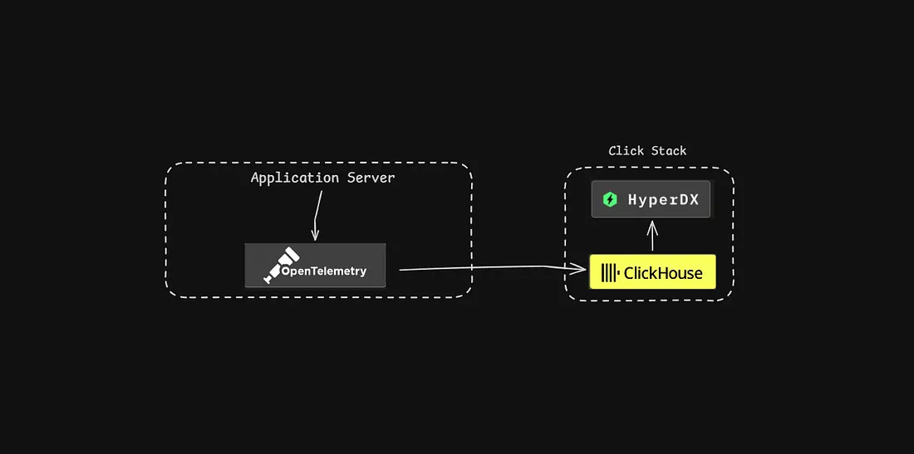
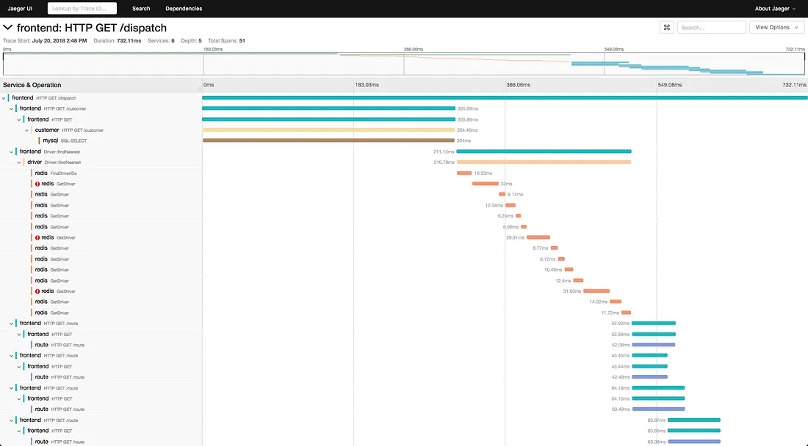
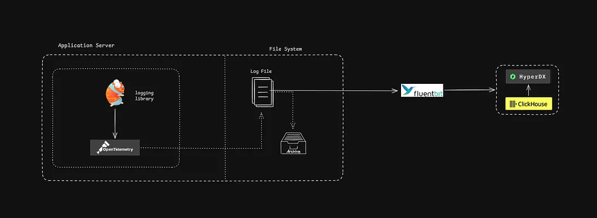
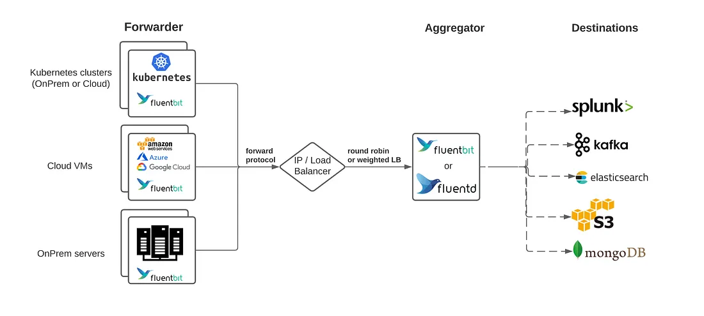

I was intrigued by stories of Facebook in early days, where the idea of logging came across multiple times in various startup school videos. I came across it with Uber’s story too where they used metrics and logs to reduce “zeroes” across the globe. What exactly do they measure ? How do they get these fascinating insights ?

***Note*** : *I made a basic prototype too as I learned various concepts. It uses Golang, OpenTelemetry and ClickHouse DB beside other tools. But the main goal of this article is to cover concepts and tools rather than their exact implementation. So no matter your programming background you can jump along and give it a read.*

### M.E.L.T. and OTel

The core of observability revolves around MELT — metrics, events, logs and traces.

- Metrics — they tell you how is your system (the ‘server’) is behaving. They are numbers associated with a fixed point in time. Like your CPU usage at 12:05 PM or how long are queries taking to execute (percentile values) — longer queries means higher lags on the user side. Studying an aggregation would help you answer questions like if the CPU usage constantly growing. If yes, we must get a bigger machine.
- Events — any important enough occurence to be tracked. A user signed-up from Japan or a payment in China failed. An aggregate would tell you important insights: 20% payments in China failed in the last hour, must be something wrong with the payment services.
- Logs — they are similar to events in some ways. Think of them as a nerdy version of events because they convey more than just events. An error occurred in the mailing service at 1:09 AM because the user entered an invalid mail address. You look at the bulk of logs and notice 18% logs related to mailing service conveying the same issue, hmm might be a DDoS attack.
- Traces — or also known as distributed tracing, track requests across multiple services. All the others terms we saw are related to a single server at a single point of time. Traces track a request from start to finish. They can help you understand the bottlenecks in your application.

One thing must be clear by now : everything in observability is a number or an information. A sign-up info could look like : `{msg: “signup from Japan”} `or `{event: “signup”, country: “Japan”, time: 12:09PM}`or any other random structure (may not be JSON). If you have been in the world of coding for a little long, you know we have an obsession with ‘decoupling’, in other words — *standardisation*. So enter [**OpenTelemetry**](https://opentelemetry.io/).

OpenTelemetry is the standard way to produce MELT data. OpenTelemetry, or OTel for short, is an open-source framework that acts as a plugin with your existing code and can produce telemetry data (*tele *means remote/distributed and *metry *means to measure). In the modern world where infrastructure is based on large number of microservices, maybe all using a different programming language, and a large number of tools (PostgreSQL, Kubernetes, Docker), producing telemetry (read MELT) data manually would be so messy. OTel simplifies this process with a set of simple APIs.

***Coding Part : Setting-Up OTel****: *If you are interested in the coding part, read through this section, else skip to the next part. The core setup is done here: [*https://github.com/DivyanshuShekhar55/Shuzook/blob/main/shazam/internals/otel*](https://github.com/DivyanshuShekhar55/Shuzook/blob/main/shazam/internals/otel)* . *If you observe closely you would notice the use of context. This is how the requests are tracked by OTel.

### OLAP Databases & Observability Backends

Reiterating myself once more : everything in observability is a number or an information. And plain text or numbers alone wouldn’t be of much value. They only make sense when aggregated and shown in a way easier to understand for the decision makers. A single signup event wouldn’t mean much. But a bulk of these telemetry data would be convey precious knowledge: number of people who signed up last month grew by 10%, percentage of people who liked dancing cats (maybe boost cat videos on the home feed), number of people from South Asia dropped by 6% (which calls for a new marketing strategy).

This is a two step process:

- **Storage of telemetry data**: this is the world of **OLAP databases** — databases optimised for analytical queries over petabytes of data. The most common optimisation being columnar storage of data. Major providers of data storage are Amazon Redshift, Snowflake (both are data warehouse providers) and ClickHouse. I chose ClickHouse, a modern analytical database. Though I haven’t yet dived into it much, I had a little prior experience with columnar storage (Cassandra).

[An intro to column-based storage](https://www.youtube.com/watch?v=a7rmLeGK1v8)

- The second part is an **observability platform**. This is where telemetry data ‘makes sense’. Graphs, charts, hierarchical representation, searching across logs and many more features that comes handy during debugging or finding patterns in data. We either have individual tools handling different aspects of telemetry data or an all-in-one solution to observation. Prometheus (for metrics), ELK stack (for logs), Jaeger and Zipkin (for traces) are major providers focused on a single aspect of observability whereas ClickStack, New Relic, Datadog and Better Stack provide unified solution to observability.

I decided to use ClickStack just because it is fairly easy to setup for dev environments and ClickStack has been rising in popularity even among the big tech companies. I could have chosen Elastic (earlier Elasticsearch) having worked with it for some time. But I needed something new !



A broad view of ClickStack

ClickHouse serves as the analytical database and HyperDX is the UI where you can monitor your application’s health. There are various ways the stack can be hosted, but they primarily fall under two categories — managed and self-hosted. Managed ClickStack provides a cloud native storage and access to your telemetry data. Open source stack is managed by you, the application developer. There are various alternatives even in the self hosted path, I chose what the docs call all-in-one Docker container. A single container that gives you storage plus the Hyper frontend.

*Note*: Read more about options for deploying here : [https://clickhouse.com/docs/use-cases/observability/clickstack/deployment](https://clickhouse.com/docs/use-cases/observability/clickstack/deployment)

## Tracing

All requests on the web carry a context with them. And when one service calls another, we can just pass this context in the metadata/header. This is the core idea behind tracking requests across different microservices. Actions with same metadata represent the same trace. A single trace can have multiple spans. A span represents a sub-process in the event. For example tracing a signup request (a trace) might have multiple spans (or units of work) such as :

- request from signup service to DB to check if username exists
- request from service to DB to insert the new user details
- showing a success/failure response to user

We can track all these spans individually. These are best represented as bars on a tracing backend such as Jaeger or in our case ClickStack’s Hyper DX.



Source : Jaeger’s official docs

Reading traces can help you understand if a query took too long to respond (big bars) and what exactly causes the delay (large spans within a parent span). OTel creates spans on its own, but many times we need to create them manually only because we can gather more detail about requests. Read more about OTel tracing here :

- [https://opentelemetry.io/docs/concepts/signals/traces/](https://opentelemetry.io/docs/concepts/signals/traces/)
- [https://opentelemetry.io/docs/specs/otel/trace/api/](https://opentelemetry.io/docs/specs/otel/trace/api/)
- My code for tracing is here: https://github.com/DivyanshuShekhar55/Shuzook/blob/main/shazam/cmd/api/tracerWorking.go

## Logging

Ok implementing logging is going to be a bit trickier than traces. We will start with a logging library, in our case Zap (an open source library for logging by Uber). For simple weekend projects the built in logging functions (`log.Print()` in Go or `logging` module in Python) works fine, but when our app starts to produce thousands of logs per second, we need better options — `Zap` for Go or `structlog` for Python. What exactly makes these better ?

- Firstly we need levels in logs. These help us differentiate severe errors (could not connect to database) from informative logs (cache miss in DB).
- Performance — standard libraries will use a considerable amount of server’s memory (for tasks like assigning spaces in memory, dynamic data types). When traffic is high we can’t afford it, Zap was designed to be zero-allocation, it barely hits app’s performance.
- adding contexts to logs (we can directly plug-in OTel to Zap)

Next, we need to consider an important point : analytic databases are often optimised for bulk inserts. Sending logs one at a time will work but this approach is not recommended. We need a way to bunch a group of logs and then send a bulk insert request to ClickHouse. One way to do it is to put all incoming logs inside a file (called a **log-file**) and once ‘enough’ logs are collected in the file, send all the logs together.

How we decide on the ‘enough’ part? This is either via a time-scheduled cron job (keep collecting logs in the file for 10 seconds then send them all), or file size based cron job (if the file hits for example 2KB size send all the logs). Once we dump all the logs to database, we usually archive them for sometime (7 days, a month or whatever). A new file is created and the new logs start going inside this log file. We call this log rotation. I implemented log rotation via `lumberjack `library in Go.



Implementing Logging

You might have noticed we have not covered one part yet — **FluentBit** (honestly this has a comparatively greater learning curve and I have just grazed the surface here). It acts as the log shipper, it collects data from any source, processes it in a pipeline, and ships it anywhere. FluentBit has 100+ plugins for accepting logs supports metrics and traces too (but I didn’t use them). We can write custom parsers (converting raw logs), filters (different data tags, different processing), route data (send ‘info’ tagged logs to S3, errors to clickhouse) and modify data too. It also got an in-built retry logic to resend data in case it fails to be inserted into DB.

FluentBit has a sibling **Fluentd**, a buffed up version of FluentBit. A common pattern is to have a fluent bit attached to each node (instances/servers) to ship logs and forward them to Fluentd (or OTel collector works too), which aggregates them and ships to the destination data store. For my implementation, this was an overkill and I didn’t use it.



Source : [https://fluentbit.io/blog/2020/12/03/common-architecture-patterns-with-fluentd-and-fluent-bit/](https://fluentbit.io/blog/2020/12/03/common-architecture-patterns-with-fluentd-and-fluent-bit/)

- Read more on Zap here: [https://betterstack.com/community/guides/logging/go/zap/](https://betterstack.com/community/guides/logging/go/zap/)
- My implementation of logging : [Logger🔗](https://github.com/DivyanshuShekhar55/Shuzook/blob/main/shazam/cmd/api/loggerWorking.go) and [fluent-bit setup🔗](https://github.com/DivyanshuShekhar55/Shuzook/tree/main/shazam/fluent-bit)

## Metrics

The final section in observability. They are relatively simple, OTel provides us instruments that can be used to calculate important metrics. The major instruments are :

- counters — strictly increasing numbers, which can be increased programmatically with an `Add()` function. For example increment the counter value by one whenever a request comes (track number of requests per hour or per day)
- up-down counters — can be incremented or decremented (use `Add(-1)` to decrement). Useful for numbers like number of active users on a website (add one when a new user shows up, subtract one when a user leaves) or number of active database connections (monitoring connections is essential to quality database pooling).
- histograms — essential for percentile calculations. What are percentile values? (P.S. they are probably the most famous concept in observability) A percentile value `pX` would tell you how long do X% of queries take to finish. For example if your `p90` value is 150ms it would mean 90% requests coming from users are finished within 150ms. They help in understanding how long users on the slower side of network will have to wait before a result shows up.
- Read all the instruments here : [https://opentelemetry.io/docs/specs/otel/metrics/api/](https://opentelemetry.io/docs/specs/otel/metrics/api/)

OTel can be setup to collect and send these numbers after a fixed time interval. Look at the following code for setting up a meter collector (it collects metric values every 3 seconds):

```go
func newMeterProvider() (*metric.MeterProvider, error) {
 metricExporter, err := stdoutmetric.New(stdoutmetric.WithPrettyPrint())
 if err != nil {
  return nil, err
 }

 meterProvider := metric.NewMeterProvider(
  metric.WithReader(metric.NewPeriodicReader(metricExporter,
   // Default is 1m. Set to 3s for demonstrative purposes.
   metric.WithInterval(3*time.Second))),
 )
 return meterProvider, nil
}
```

## Conclusion

Honestly, it was challenging to learn but it was fun too. I hope you loved reading my blog. Please drop a clap and give a star to my GitHub repo : https://github.com/DivyanshuShekhar55/Shuzook.

See you next time, on the other side of knowledge :)
