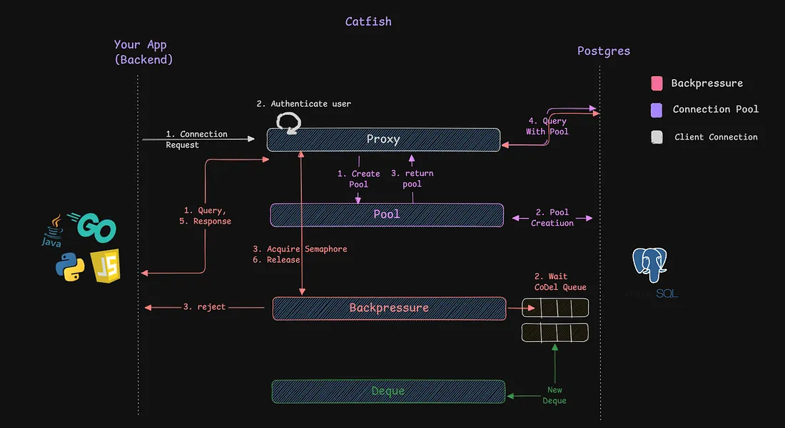
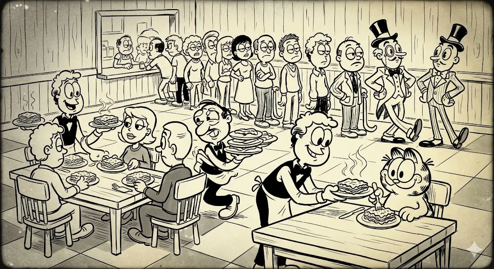

So a few weeks ago I came across a fresh new article on my tech feed : “PGKeeper : Building the Bouncer We Needed For Postgres”. Half sure I would understand it, I still read it halfway, fed the other half to Claude, read the various libraries and algorithms mentioned and a lot of thinking. It took me a week to grasp the blog, but it was fun. Before I finished the blog, I was certain it would be a fun little side project. So another two weeks passed by and I finished what might be the second most complex project of my life.

That said the blog assumes you have prior experience with connection pooling with PgBouncer. If not, here is a good one for you :[PlanetScale Guide to PgBouncer](https://planetscale.com/blog/scaling-postgres-connections-with-pgbouncer).

### The Problem with PgBouncer

Honestly its great. Almost everyone uses it — until you come across few unique problems :

- It treats all queries equally. Serving users should be the prime focus of any user oriented application, but assume all your connections being occupied by analytic jobs and the users keep waiting. There is no way in PgBouncer to let users have a higher weight in connection assignment.
- Its single threaded, one thread runs all the connection assignment job. It’s fine with a smaller number of requests, but with large number of requests demanding a connection, it’s a significant bottleneck. Puts a cap to vertical scaling .
- It lacks load management. When queries can’t be served instantly they are queued. Imagine a request waiting for a couple of second, the frustrated user might have cancelled it already. But there it is, still occupying a seat in the queue. And it is not alone, there could be so many other cancelled, ditched requests lying. Further, it starts a waterfall effect, new queries end up behind these dead requests. PgBouncer reads through all the queries, finds it was cancelled, removes them and then reach our ‘new’ request. By that time, even the new query gets stale.
- Lastly, Figma needed more with their pooler. Namely, flags and observability. These are important metrics reflecting the health of pooler and helps the application to warm up before an issue occurs.

### PGKeeper

This is where PGKeeper came in. Engineers at Figma took a year to develop an in-house connection pooler, that is more than a connection pooler. Its a private tool, that can handle request surges, manage load intelligently, differentiate between a high and low priority request, is multi-threaded and provides useful insights and metrics about health of the service.

Obviously, I didn’t implement everything, but it is still a lot. I will only cover the parts I implemented. If you are interested you can read the [original PGKeeper blog](https://www.figma.com/blog/pgkeeper-building-the-bouncer-we-needed-for-postgres/) too.

## Catfish

First of all, what’s up with the name? Well I think connection poolers are kind of like catfish accounts. They give a lavish view of what is mostly a simpler, not-so-grand thing. Connection poolers make your app believe there are a lot of connection open and free to acquire connections. The reality is different — Postgres connections are expensive and we can’t have many of them. We can’t keep closing old ones and reopen new ones in their place, we waste a lot of server resources that way. So we never (we do, just after a long time) close them, we keep recycling them. A smaller number of connections are to be used by a large number of applications.

Catfish is written on top of `jackc/pgx` library in Golang, arguably the best library to work with Postgres. I will walkthrough the implementation step by step in this blog, trying to keep it simple and intuitive. The first part I implemented was the connection pool.



An overview of Catfish

### Enter The Pool

This was relatively an easier part. It just wraps around the core `pgxpool `package with minor tweaks here and there. The library is based on an assumption that each (user, database) pair gets a separate pool. However I made another decision to keep a global settings for all the pools — `MinConns`, `MaxConns`, `MaxConnIdleTime`, etc,. These are set once in the config file. All pools inherit this global setting.

Take a look at the `Exec()` function from catfish, it wraps around pgxpool’s execute function. A connection is withdrawn from Catfish’s pool and is passed to pgxpool’s `Exec()`.

```go
func (p *Pool) Exec(ctx context.Context, sql string, args ...any) (pgconn.CommandTag, error) {
 // acquire a connection from pool
 conn, err := p.inner.Acquire(ctx)
 if err != nil {
  return pgconn.CommandTag{}, fmt.Errorf("%w: %w", ErrAcquireConn, err)
 }
 defer conn.Release()

 // get response back from pg and return back the same response to user
 cmdTag, err := conn.Exec(ctx, sql, args...)
 if err != nil {
  return pgconn.CommandTag{}, fmt.Errorf("%w: %w", ErrExecConn, err)
 }
 return cmdTag, nil
}
```

The interesting parts are `rollbackIfNeeded `and `drainRows`. Remember what we said about recycling connections, we don’t close connections once the user has received the response for his query. The same connection will be used for running other queries from users of the same pool. But what if the previous query ended up in an unfinished transaction (neither committed nor rolled-back) or the user didn’t read the results? Those results are still pending to be read inside the connection. If we just pass around the connection to another user, he will read these weird results before he reads his own response.

We use `pgx.Conn.AfterRelease()` function. This function is run automatically after a connection is released but before it is returns to the pool — the perfect time to run side effects. We simply check if the last query resulted in an unfinished transaction, in which case we `ROLLBACK` the transaction via `rollbackIfNeeded()`. Similarly if the user had left unread rows on the connection we “drain” them. Which means we simply read them using `drainRows()`

There are a few more details to handle here : auto-closing the connections after user finished reading her response and auto warming the pool until `MinConns` number of connections have been acquired. These are however better explained in the codebase itself, covering them here would make the blog kinda boring. Another design decision was not to expose any `Pool.Acquire()` method to users that gives them access to individual connections from a pool. This was because once acquired, user can directly run SQL queries. Instead we want the queries to pass through our proxy service which decides (based on current load) whether the query should run or be queued.

### A Simple Deque

The next part was to implement a simple deque — a queue data structure that can accept and removes data items from both ends. There were some popular deque implementations on GitHub but for this use case they all were overkill. The reason being that we don’t have to care about resizing a queue once its full, no manual memory management. We are making a queue responsible for load management. It doesn’t have to increase its capacity for load, rather return a “we are too busy, try again later” message once the queue is full. No more requests shall be accepted beyond the queue size (configured by the user).

So the best option was to implement it myself, and it was just like another algorithmic challenge (yes, those LeetCode ones !)

### Managing Traffic with Backpressure

This one is tricky — bunch of structs, algorithms and calculations happening all at once. The best way to understand it is an analogy :



This image is the only AI generated content in the blog :)

Imagine a really busy restaurant, and the owner is sort of biased to the rich (I know it’s terrible). There are a fixed number of tables which we call `MaxConcurrent` in our case, the maximum requests that can be served at any given point. People (the requests) who can’t get a table (token/ticket) have to wait back in lines (the queues). Once a request gets a “ticket” they get a seat. One table serves one request. Keep in mind : there are multiple queues — one queue holds people of same priority together. Two different priorities, two different queues. But all priorities compete to get the same seat.

Since there is a contention among various entities (the queue members) for a single resource (the seats or tokens), we need a lock on the table to avoid race condition. The `MaxConcurrent` is part of this Semaphore. A semaphore is used to control access to a common resource by multiple processes/threads, it uses and internal counter (`outstanding`) and two atomic operations Wait (or `Acquire()`) and Signal (or `Release()`).

It’s not just that. Next comes the idea of “***debt***”. Remember the biased owner ? It’s the semaphore. Whenever a request from the higher priority queue is found to wait because of the lower priority ones, the semaphore can order a debt increase on the lower priority queues. For example a debt of 2 on the lower priority queue means 2 seats are reserved for the higher ones, the prior can’t acquire them. It is reasonable because increasing debt means increasing number of reserved seats, which allows the critical requests waiting in the line to be served.

The reverse of this situation is when a critical query was served without any wait at all, it might mean the owner was overly strict with other customers. Maybe more than required seats are reserved. In this case the owner can declare a decrease in the debt. An important part of this self-adjusting debt is forgiving the debt entirely. This is by default done every 10 seconds. We can deduce given a queue size of 200, 3 queues and assuming 10ms for each request to be served, that it takes around 6 seconds until a set of completely new queries fill up the queues. A new set means a new pattern of incoming requests, we can’t use the formerly learned debt to handle it.

The final part to backpressure is : ***CoDel***** **(Controlled Delay) algorithm. It is a load shedding algorithm that sheds work based on how long requests have been waiting, not how many are queued. Imagine a customer in our imaginary restaurant that came at 7'O clock, will he rather wait until midnight or decide to leave and come back tomorrow. The same happens with requests. Read the load management issue of PgBouncer we covered at the start. It is a waste to serve queries in a FIFO sense when the queue is too long. Resolving older requests first, only to discover they already expired or were cancelled. All this while the newer requests are put on hold at the back. The CoDel algorithm is used to switch from FIFO to a LIFO order of request execution and vice-versa when the load is low.

This is why we needed a deque in the first place, all priority queues are actually “priority deques” controlled by CoDel. A `reap()` is used to kill stale queries periodically from the queue. The reap timeout is lower during LIFO mode, which means it aggressively kills requests when queue is under a heavy load.

A final issue with CoDel is another race case condition. A context expired or user manually cancelled a request which was waiting in the queue, but at the exact moment it was admitted (given a ticket) by the semaphore. Carelessly handling this would both report to the user with “sorry we are busy” as well as actually execute it. That’s not good ! Hence we wrap the query in a `coDelWaiter` struct :

```go
type coDelWaiter[T any] struct {
 // time of enqueue, used for reap
 enqueued time.Time
 // An atomic state variable (0 = waiting, 1 = admitted, 2 = client expired)
 state uint32
 // A channel used to signal the outcome (true = success, false = dropped)
 c chan bool
 // the actual data carried by the request
 payload T
}
```

This struct assigns a Go channel to the waiting customer. Whenever `admit()` (semaphore accepted it) or `ctx.Cancel()` (rejected for waiting too long) is called, these functions try to atomically swap the `state` variable from the struct. The winner of this contention is the one to decide what will happen to the query. If state was set to 1 by the `admit()` function, it will be admitted only, context cancellation loses the right to cancel the query.

```go
func (cw *coDelWaiter[T]) wait(ctx context.Context) error {

 // the select is responsible for keeping the request blocked, smthing must happen (the cases) to wake it up
 select {
 // context timed out / cancelled
 case <-ctx.Done():
  // context cancel
  // try to update the state atomically
  // if state was = 0 (waiting), set to 2 (client expired) now
  didSwap := atomic.CompareAndSwapUint32(&cw.state, 0, 2)
  if !didSwap {
   // failed to swap, state value must already have been = 1
   // i.e., admitted => no error
   return nil
  }
  // ctx cancelled succesfully, return error = context error to let user know
  return ctx.Err()

 case v := <-cw.c:
  if v {
   // v is true, request accepted by codel
   return nil
  } else {
   // reap rejected the request, send error
   return ErrRejected
  }
 }

}

// admit will attempt to admit the request, returns true if admission successfull
func (cw *coDelWaiter[T]) admit() bool {
 isAdmitted := atomic.CompareAndSwapUint32(&cw.state, 0, 1)
 if isAdmitted {
    cw.c <- true
 }
 return isAdmitted
}
```

Well that was a lot maybe. But that’s it with backpressure. I must credit the [*backpressure package*](https://github.com/bradenaw/backpressure) which helped me understand this otherwise complex code. We can now move the top layer of our system: the proxy layer.

### The Proxy

It is the Catfish server’s configuration. The clients that want to connect to catfish service go through this layer. We can intercept the queries and responses here before they reach to user or postgres respectively. This allows a wide range of operations we can perform midway — tracking whether the last query finished or not, monitoring queries, etc,. At this layer we read the users from the config file (use a yaml reader), we read the password for each user from the .env file. We create pools (using our own pool package) for each of these (user, database) pair. This all done at start-up. The next logical step is to listen to users who want to connect. This is a simple forever running loop listening for TCP connection requests to our server. We spin-off a new goroutine to handle all clients independently. This is how we overcome PgBouncer’ s single threaded nature.

This is also where we do the client authentication part. The first is to check whether the user requesting access was allowed in the config file or not. This is important because we setup the pools already, we can’t accept dynamic connections. All the users who would compete for the fixed number of pools is decided at start-up. It also means we handle authentication ourselves. Postgres has a `pg_hba.conf`file that handles the authentication rules, methods and access control. The authentication process has a number of message exchanges between the app and the postgres server. This is where jackc/pgx/pgproto3 package comes in handy. It exposes all these messages as Go structs. And honestly there is a lot here, learning the auth flow as well as the message structs was a mess. And LLMs helped me a ton at this stage. I didn’t have to waste hours exploring the exact struct I needed at each step. The current state of the Catfish has Cleartext, MD5 and SCRAM-SHA-256 methods of authentication implemented. And writing code for these was fun actually, SHA-256 in particular ( partly because university courses on cryptography finally made some sense :) ).

Covering the auth flow or the `pg_hba.conf` would be too much. That deserves a blog post in itself. Please bear in mind that Catfish doesn’t handle SSL authentication currently. Once authentication for the user is successful, he can finally send requests to our server. Another function `clientLoop()` is responsible for all handling all messages that are fired on this pool nest. The message type `*pgproto3.Query` is handled with a `handleQuery()` function. This is where backpressure comes in. Each query has to acquire a token before it can be executed. Once the response from Postgres is streamed back to the client, the acquired token is released back to the semaphore.

There are numerous little details I have left here such as clean Shutdown (multiple paths to close a connection), handling extended queries, handling query terminations, handling queries that threw error midway, etc,. Another decision I made for now was to assign each query a weight of one. It would be quite a task to think which queries have a higher weight and which ones lower. All queries hence take up a single token. Another fun side-project would be to have a lightweight machine learning model analyse and assign a weight to each query that passes by.

### Wrapping Up

So the final stage was deploying this as a Docker Image on DockerHub (maybe GHCR too in future). As the user you can directly pull the image, mount the yaml config at runtime and you are ready to go :)

Here is the GitHub repo : [DivyanshuShekhar55/Catfish](https://github.com/DivyanshuShekhar55/catfish)

And here is the Docker Image : [https://hub.docker.com/r/skywalkerx42/catfish](https://hub.docker.com/r/skywalkerx42/catfish)

I would love to have forks and contributions (specially SSL, monitoring and password handling for now). Thanks for the read. 読んでくれてありがとう！またね。.
