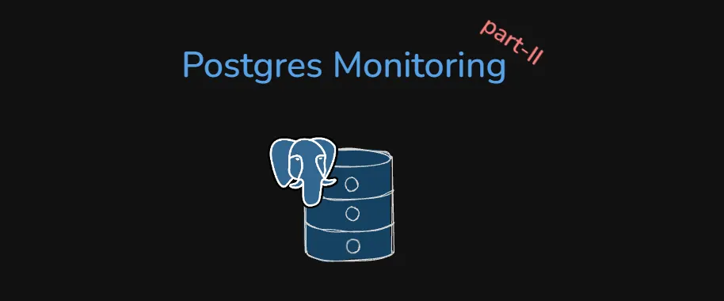

If you haven’t checked out the first part of this blog please give it a go: [***Part-I***](https://medium.com/@shekdivyanshu/everything-about-your-postgres-server-monitoring-part-i-b3d0a974981c). In the last part we covered basic understanding of statistics, dynamic stats, followed by important numbers related to WAL, checkpoints and archiving.

In this blog post we shall continue from the 4th part :

## Part Four — Database, Table & Index Statistics

Now that we understand the transaction and WAL machinery, we can move to the part that is much more directly connected to diagnosing slow tables, missing indexes, and vacuum problems.

This is where we start asking questions like:

*Is this table being scanned too much?*

*Is autovacuum keeping up?*

*Are my indexes actually being used?*

*Is my cache doing its job?*

## pg\_stat\_database

`pg_stat_database` gives us one row per database and acts almost like a database-wide health dashboard.

It includes the current number of connections, committed and rolled-back transactions, cache hits and reads, temporary files, deadlocks, I/O timing, and the time at which the statistics were reset.

`numbackends` tells you the current number of connections.

`xact_commit` and `xact_rollback` tell you how many transactions have committed and rolled back.

`blks_read` and `blks_hit` are the values used to calculate cache hit ratio.

`temp_files` and `temp_bytes` tell you about temporary files created on disk, which can indicate that queries needed more `work_mem` than was available and spilled work to disk.

`deadlocks` counts detected deadlocks.

And `blk_read_time` and `blk_write_time` measure cumulative time spent waiting on those reads and writes. These require `track_io_timing` to be enabled, and they are duration counters rather than timestamps.

Finally, `stats_reset` tells you when the counters were last reset, which is important because you should use that timestamp when calculating rates.

## What Should We Actually Check?

The first obvious metric is the cache hit ratio:

```
blks_hit / (blks_hit + blks_read)
```

For a typical OLTP workload, around 99% or higher is a common rule of thumb. A low ratio can mean that `shared_buffers` is too small or that the workload simply contains a lot of cold reads.

Then look at rollbacks. If the rollback ratio is unusually high compared to commits, it may indicate application-level errors or retry behaviour.

Temporary files are another very useful signal. If `temp_files` or `temp_bytes` keeps climbing, queries are spilling work to disk because they don't have enough `work_mem` for what they are trying to do.

Deadlocks should ideally be zero or very rare. If they are occurring consistently, there is usually an application-level locking-order problem worth investigating.

And if you’re using a connection pooler, `numbackends` is especially useful because it tells you how many real database connections are currently open compared with your available connection capacity.

## Is `blks_hit` The Same As `hits` In pg\_stat\_io?

They represent the same general idea, but the scope is different.

`blks_hit` in `pg_stat_database` represents total cache hits for the whole database across all backends.

`pg_stat_io` gives you a more detailed breakdown of hits by backend type, object, and context.

So one is your broad database-level view, while the other lets you ask exactly **who** is getting those hits and **what kind of I/O** they are doing.

## pg\_stat\_database\_conflicts

If you are running a standby, `pg_stat_database_conflicts` becomes useful.

This view tells you why queries on the standby were cancelled because of conflicts with replication.

For example, `confl_tablespace` means the standby needed a tablespace that was dropped on the primary.

`confl_lock` means a standby query held a lock that the replayed WAL change needed.

`confl_snapshot` means a query needed an old snapshot, but the corresponding data had already been vacuumed away on the primary.

`confl_bufferpin` means a standby query pinned a buffer that WAL replay needed.

And `confl_deadlock` means replay caused a deadlock.

Ideally, these should all stay at zero or close to zero. If they keep increasing, standby queries are being cancelled to allow replication to continue. Depending on the situation, `hot_standby_feedback = on` or increasing `max_standby_streaming_delay` can help.

## pg\_stat\_all\_tables

Now let’s go one level deeper and look at individual tables.

`pg_stat_all_tables` gives you one row per table in the current database. There are three versions of this view: `pg_stat_all_tables`, `pg_stat_user_tables`, and `pg_stat_sys_tables`.

The scan counters tell you how the table is being accessed.

`seq_scan` is the number of sequential scans, while `seq_tup_read` tells you how many rows those scans read.

Then `idx_scan` tells you the number of index scans and `idx_tup_fetch` tells you how many rows were fetched through indexes.

If a large table has a huge number of sequential scans compared with index scans, that is at least a reason to investigate whether an index is missing.

## Table Write Activity

The same view also tells you about writes.

`n_tup_ins` counts inserted rows, `n_tup_upd` counts updated rows, and `n_tup_del` counts deleted rows.

Then there are two counters that become interesting when thinking about bloat.

`n_tup_hot_upd` counts updates that qualified for HOT, or Heap-Only Tuple updates. These are cheaper because they don't require changes to indexes.

`n_tup_newpage_upd` counts updates that needed a new page, which is the more expensive opposite of HOT.

## Live Rows, Dead Rows & Analyze

`n_live_tup` is an estimate of the number of live rows in the table, while `n_dead_tup` estimates the dead rows — rows created by updates or deletes that haven't been cleaned up by vacuum yet.

There is also `n_mod_since_analyze`, which counts how many rows have been modified since the last `ANALYZE`. This can tell you whether your planner statistics might be getting stale.

Then you have the maintenance history: `last_vacuum`, `last_autovacuum`, `last_analyze`, and `last_autoanalyze`, along with `vacuum_count` and `autovacuum_count`.

This gives us some very practical signals.

If a large table has lots of sequential scans, investigate missing indexes.

If `n_dead_tup` is becoming large relative to `n_live_tup`, autovacuum may not be keeping up.

If a high-write table hasn’t been auto-vacuumed for a long time, look at its `autovacuum_vacuum_scale_factor` and `autovacuum_vacuum_threshold`.

And if the ratio of HOT updates is low, the updates may be touching indexed columns or the pages may not have enough free space for HOT updates, which can contribute to more bloat.

A useful query for getting a quick picture of this is:

```
SELECT relname, seq_scan, idx_scan, n_live_tup, n_dead_tup,
       round(n_dead_tup::numeric / nullif(n_live_tup,0), 3) AS dead_ratio,
       last_autovacuum
FROM pg_stat_user_tables
ORDER BY n_dead_tup DESC;
```

## pg\_stat\_all\_indexes

Now let’s talk about indexes.

`pg_stat_all_indexes` gives you one row per index and helps answer one very important question:

> *Is this index actually being used?*

`idx_scan` tells you how many index searches have been performed.

`idx_tup_read` tells you how many index entries or pointers Postgres looked at inside the index.

And `idx_tup_fetch` tells you how many actual live table rows were fetched using that index.

You can think of the difference as:

**`idx_tup_read`****: how many index entries did Postgres inspect?**

**`idx_tup_fetch`****: how many actual rows did it go and fetch?**

## Why Are idx\_tup\_read And idx\_tup\_fetch Different?

You might expect these numbers to be equal, but they aren’t.

One reason is MVCC and dead rows. The index can point to a row, but when Postgres visits the table it can discover that the row is no longer visible because it was updated or deleted by another transaction. So the index entry was read, but a valid row wasn’t fetched.

The other major reason is index-only scans. If a query can get everything it needs directly from the index, Postgres doesn’t need to visit the table at all.

For example:

```
SELECT id FROM users WHERE id = 5;
```

In that situation, `idx_tup_read` can increase while `idx_tup_fetch` stays low or even at zero.

## Bitmap Scans Are A Special Case

Bitmap scans make this slightly more complicated.

Postgres can combine results from multiple indexes using AND/OR operations. Because those results are combined, it becomes difficult to attribute the individual heap-row fetches back to one specific index.

During a bitmap scan, `idx_tup_read` is incremented for the indexes involved, and the table's `idx_tup_fetch` is incremented, but the individual index-level `idx_tup_fetch` isn't affected.

## Why Can idx\_scan Be Higher Than Expected?

Another thing that can surprise you is `idx_scan`.

A single query execution can trigger multiple index searches. A query such as:

```
WHERE col IN (1, 2, 3)
```

can result in multiple index searches. An `OR` chain can also be transformed into an array operation, and B-tree skip scans can reposition within the index multiple times.

So `idx_scan` can sometimes be much higher than the number of actual query executions.

If you need the exact number of index searches performed by a scan node, `EXPLAIN ANALYZE` is the better tool because it shows the total number of searches associated with that scan node.

You can inspect index usage with:

```
SELECT relname, indexrelname, idx_scan, idx_tup_read, idx_tup_fetch
FROM pg_stat_user_indexes
ORDER BY idx_scan ASC;
```

An index with `idx_scan = 0`, or extremely low usage on a non-trivial table, can be a candidate for dropping because even an unused index still creates write overhead on inserts and updates.

## pg\_statio\_all\_tables

`pg_statio_all_tables` has a similar per-table structure, but now the focus is specifically I/O.

It tells you how often the table’s data and indexes were found in cache versus how often they actually had to be read from disk.

`heap_blks_read` and `heap_blks_hit` refer to the table's own data pages.

`idx_blks_read` and `idx_blks_hit` represent the combined I/O for the table's indexes.

And then there are `toast_blks_read` and `toast_blks_hit` for TOAST data, which is where Postgres stores large values outside the main table.

## But Why Does An Index Need A Disk Read?

You might think an index is supposed to make lookups faster, so why would an index itself need to read from disk?

Because the index is also a physical data structure stored on disk.

For a B-tree lookup, Postgres still has to read the relevant B-tree pages into memory so that it can walk through the tree and find the matching rows.

So there are actually two different sets of pages involved.

The index pages help Postgres figure out **where** the matching rows are, while the heap/table pages contain the actual row data that Postgres may need to fetch.

An index-only scan can skip the table access, but the index itself can still require disk reads if its pages aren’t currently cached.

You can get a simple picture of table cache behaviour with:

```
SELECT relname,
       heap_blks_hit, heap_blks_read,
       round(heap_blks_hit::numeric
             / nullif(heap_blks_hit + heap_blks_read, 0), 4)
             AS heap_hit_ratio
FROM pg_statio_user_tables
ORDER BY heap_blks_read DESC;
```

For hot OLTP tables, around 99%+ hit ratio is a common target. If the hit ratio is low while disk reads are high, it can indicate that the table’s working set doesn’t fit into `shared_buffers`.

## Part Five — I/O, Buffers & Background Writers

Now we are getting into the deepest and most mechanical part of Postgres monitoring.

This is basically the layer where we ask:

*Is my cache actually working?*

and:

*Is my disk keeping up?*

## pg\_stat\_io

`pg_stat_io` gives us a detailed picture of I/O operations, including reads, writes, and related activity.

Instead of simply telling you “Postgres read some data”, it breaks the information down by who performed the I/O and what kind of I/O it was.

Each row represents a combination of:

`backend_type + object + context`

The `backend_type` tells us who is doing the work.

A `client backend` is a normal connection executing queries.

An `autovacuum worker` is doing background vacuum work.

The `background writer` is flushing dirty pages.

The `checkpointer` is doing checkpoint I/O.

And the `walwriter` is writing WAL.

This distinction is useful because it lets you separate very different situations. You can ask whether autovacuum is generating a large amount of read I/O or whether normal client queries are missing the cache.

Then there is the object being touched.

`relation` means normal tables and indexes.

`temp relation` means temporary tables.

`wal` means the Write-Ahead Log.

And the context tells you how the I/O happened.

`normal` is the usual path through shared buffers.

`vacuum` is vacuum/analyze I/O outside the normal buffer pool.

`bulkread` and `bulkwrite` are used for large sequential scans and operations such as `COPY`, helping them avoid destroying the normal cache.


A useful query is:

```
SELECT backend_type, object, context, reads, writes, read_time, write_time
FROM pg_stat_io
WHERE reads > 0 OR writes > 0
ORDER BY reads DESC;
```

One important detail: `read_time` and `write_time` stay at zero unless `track_io_timing` is enabled.

## Understanding The pg\_stat\_io Counters

The individual counters are useful once you know what they represent.

`hits` means a needed block was already found in a shared buffer.

`evictions` means a block was written out of a buffer to make room for another use.

`reuses` refers to an existing buffer being reused inside the size-limited ring buffer used for bulkread, bulkwrite, and vacuum operations.

`fsyncs` counts `fsync()` calls, and this is tracked only in the normal context.

## Why Does A Bulk Operation Need Its Own Ring Buffer?

Imagine a huge sequential scan.

If Postgres treated that scan like every other query and loaded thousands of pages into the normal `shared_buffers`, it could completely trash the cache.

You could run one giant `SELECT *` and suddenly evict the hot pages that all your other queries depend on.

That is why bulk operations get a small, fixed-size ring buffer outside the main pool.

Pages are read into this small ring and the same slots are repeatedly reused. This keeps the footprint of the bulk operation small and protects the rest of `shared_buffers` from a one-time giant scan.

This also explains the slightly confusing meaning of `evictions` in this context. It doesn't mean that a page was simply kicked out of `shared_buffers` to make room for another page in `shared_buffers`. It means a page was pulled out of shared buffers specifically so that the bulk operation could use its separate ring buffer.

And `reuses` tells you how often those existing ring slots are being reused. Once the ring is full, the next page can reuse an existing slot instead of allocating another one. So a high reuse count can actually mean that the ring buffer is doing exactly what it is supposed to do.

## Is fsync Really A Forced Write To Disk?

Yes.

A write can simply land in the operating system’s cache without being physically durable yet.

`fsync()` is the operation that forces the storage system to persist the data and confirm that persistence.

That makes `fsyncs` a useful signal for disk-write cost. If you see high fsync counts together with high `write_time`, storage may be becoming a bottleneck.

## pg\_stat\_bgwriter

The background writer is responsible for cleaning up dirty pages by writing them to disk during normal operation.

`pg_stat_bgwriter` gives us metrics for that process.

`buffers_clean` tells us how many memory pages were written to disk by the background writer during routine cleanup.

`maxwritten_clean` tells us how many times the background writer had to stop its cleanup scan early because it hit the maximum number of pages it was allowed to write in that round.

`buffers_alloc` tells us how many times a buffer slot had to be allocated to load new data into memory.

And, just like with the other cumulative counters, `stats_reset` tells us when the counters were last reset so that we can calculate meaningful rates.

## maxwritten\_clean — The Warning Light

Ideally, `maxwritten_clean` should remain zero or very low compared with the amount of time the system has been running.

If it is steadily or rapidly increasing, the background writer is repeatedly failing to keep up with incoming dirty pages.

Possible actions include increasing `bgwriter_lru_maxpages` or reducing `bgwriter_delay`.

## What Does buffers\_alloc Tell Us?

A high `buffers_alloc` rate means the database is frequently loading data into memory that wasn't already cached.

That can happen because of heavy read workloads, full table scans, or because the active working set is larger than `shared_buffers`.

A low rate generally means Postgres is getting more benefit from the data already in memory and is not constantly needing fresh buffer allocations.

There is also an interesting comparison between `buffers_clean` and `buffers_alloc`.

`buffers_clean` tells you about pages written by the background writer, while `buffers_alloc` represents buffer allocations requested by backends.

If the background writer is doing very little compared with the overall activity, it can mean that backends or the checkpointer are doing most of the disk writes and the background writer isn’t being used much.

But there is an even more direct warning signal.

## buffers\_backend — A More Direct Red Flag

`buffers_backend` represents pages that backend processes had to write themselves because the background writer or checkpointer didn't get there in time.

This is often a more direct red flag than `maxwritten_clean`.

Why?

Because now the process actually serving your query is the one doing the disk write.

And if a query-serving backend has to stop what it is doing and write dirty pages itself, the query can stall.

So if `buffers_backend` is consistently high, that is a strong signal that the background writing/checkpointing system isn't keeping up with the workload.

## Part Six — Replication

Finally, let’s talk about replication.

At a high level, a primary server generates changes and a standby or replica receives them.

Physical replication works at the whole-cluster level, while logical replication gives you more control over which tables or changes are replicated.

The monitoring views are slightly different depending on which side of the replication connection you are looking at.

## pg\_stat\_replication

On the primary, `pg_stat_replication` gives you one row for each connected standby.

This is where you can see how far behind each replica is using things like:

`flush_lag`, `replay_lag` , `write_lag`

and you can also see the current replication state, such as `streaming` or `catchup`.

So if your question is:

*“Are my replicas keeping up with the primary?”*

this is one of the first views you want to check.

## pg\_stat\_replication\_slots

Also on the primary, `pg_stat_replication_slots` gives you statistics about logical replication slots.

It tells you things such as how much decoding data was spilled to disk or streamed, which can be useful when tuning `logical_decoding_work_mem`.

## pg\_stat\_wal\_receiver

Now move over to the standby.

`pg_stat_wal_receiver` tells you what the standby is receiving from the primary, including information such as the last WAL location received and flushed.

You can think of it as the standby-side counterpart to `pg_stat_replication`.

## pg\_stat\_recovery\_prefetch

`pg_stat_recovery_prefetch` is also a standby-side view.

It tells you how well WAL block prefetching is working during crash recovery and WAL replay, including how many prefetches were useful versus how many were actually needed.

This becomes useful when you are trying to understand how efficiently a standby is catching up and replaying WAL.

## Logical Replication

For logical replication, the subscriber has its own views.

`pg_stat_subscription` shows the worker processes handling logical replication and their progress.

Then `pg_stat_subscription_stats` gives you errors and conflicts during logical replication, including things such as unique constraint violations and missing rows.

So if you’re asking: *“Is logical replication silently failing?”*

this is the place to look.

The easiest mental model is:

**Primary:** `pg_stat_replication` + `pg_stat_replication_slots` → "How are my replicas doing?"

**Standby:** `pg_stat_wal_receiver` + `pg_stat_recovery_prefetch` → "How am I receiving and catching up?"

**Logical subscriber:** `pg_stat_subscription` + `pg_stat_subscription_stats` → "How is logical replication behaving on the subscriber?"

This isn’t directly relevant to Catfish itself because Catfish is a connection pooler rather than a replication system, but if the Postgres server behind the pooler is replicated, these views become important.

## So… What Do I Actually Look At When Something Goes Wrong?

At this point, there are a lot of views.

And I know what you’re probably thinking: *“Am I really supposed to remember all of these?”*

No.

You don’t need to memorize every column in every `pg_stat_*` view.

What matters is having a mental path through the system.

If something is slow **right now**, start with `pg_stat_activity`. Look at the state, query, duration, and wait event.

If the wait event says `Lock`, move to `pg_locks` and find out who is holding the lock.

If commits suddenly feel slow, look at `pg_stat_wal` and investigate WAL sync time and full-page-image behaviour. Then check `pg_stat_checkpointer` to see whether checkpoints are happening too frequently.

If disk I/O looks suspicious, move to `pg_stat_io` and `pg_stat_bgwriter`. Ask who is actually doing the I/O and whether backend processes are being forced to write dirty pages themselves.

If one table looks unhealthy, use `pg_stat_all_tables`. Look at sequential scans, index scans, dead rows, autovacuum history, and modifications since `ANALYZE`.

If an index looks suspicious, use `pg_stat_all_indexes` and check whether it is actually being used.

If cache behaviour looks wrong, use `pg_statio_all_tables` and `pg_stat_io` to separate cache hits from real disk reads.

And if you have replicas, use the replication views on the primary and standby to understand lag and replay behaviour.

That is the actual value of all these statistics.

Not memorizing them.

Knowing **which one to reach for next**.

## One Last Thing — These Numbers Are Not Your History

There is one idea I want to come back to because it applies to almost everything we discussed.

Most of these `pg_stat_*` values are not a historical record.

They are counters and snapshots that tell you what has happened since the last reset.

If the database restarts or you reset the counters, the historical information in those counters can disappear.

So if you actually care about how your Postgres server behaves over days, weeks, and months, you shouldn’t rely on manually running these queries whenever something breaks.

You should scrape them.

Store them.

Graph them.

A setup such as Prometheus + postgres\_exporter gives you exactly that. Instead of looking at a raw number and saying:

> *“wal\_bytes is 500 GB.”*

you can look at the graph and say:

> *“WAL generation increased by 120 MB/s during that deployment.”*

And that second statement is much more useful.

Because now you have context.

You can compare it with traffic.

You can compare it with checkpoints.

You can compare it with disk I/O.

You can compare it with commit latency.

And suddenly a metric becomes an explanation rather than just a number.

## The Big Picture

After going through all of this, Postgres monitoring might look like a huge collection of unrelated statistics.

But they actually form a pretty clean picture.

The **activity views** tell you what is happening right now and, when something is stuck, what it is waiting for.

The **WAL and checkpoint statistics** show you how Postgres is making changes durable and how that durability work interacts with disk I/O and commit latency.

The **database, table, and index statistics** tell you whether your workload, schema, indexes, and vacuum configuration are behaving the way you expect.

The **I/O and buffer statistics** tell you whether your cache is actually earning its keep and whether your storage system can keep up with the amount of work Postgres is asking it to do.

And the **replication statistics** tell you whether your replicas are receiving, flushing, and replaying changes properly.

More importantly, these things are connected.

A slow commit can lead you to WAL. WAL can lead you to checkpoints. Checkpoints can lead you to disk I/O. Disk I/O can lead you to buffer behaviour.

A slow query can lead you to `pg_stat_activity`.

A wait event can lead you to a lock. A table with too many dead tuples can lead you to autovacuum. An unused index can lead you to a schema decision. And a replica falling behind can lead you through WAL receiver and replay statistics.

That, to me, is what good database monitoring actually means.

It isn’t about looking at a hundred numbers and deciding whether each one is “high” or “low”. It is about starting with a symptom and following the chain until you find the thing actually causing it. Because at the end of the day, monitoring isn’t really about collecting metrics. It is about being able to answer questions.

*Why is Postgres slow?*

*What changed?*

*Why did WAL suddenly spike?*

*Why are commits taking longer?*

*Why is autovacuum falling behind?*

*Why are replicas lagging?*

*Why is my disk suddenly doing so much work?*

Once you have the right statistics, collected over time, those questions stop being guesses. You can actually follow the evidence. And that is when monitoring becomes useful. Because you’re no longer just watching your Postgres serve**r**. You’re actually understanding what it is doing.