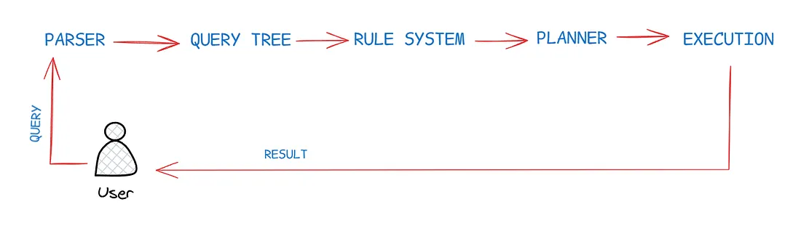

A few questions would be enough to trigger your curiosity : Can you run your own custom logic whenever a query is executed, overwriting PostgreSQL’s defaults? Can you hide some columns of your table from some people ? Can you cache a query’s result ? We will look at the answers to these questions throughout our blog.

### Before We Begin



This is a simplified view of how the database converts query into results. For this blog, we focus on only two parts: the Query Tree and the Rule System. The query tree is a tree data structure and there are few major components to it :

- statement — the statement like SELECT or INSERT
- range table — the tables which must be queried to produce result. Internally PostgreSQL uses numbers instead of table names
- result relations — points to tables which need to be modified (not the case for SELECT queries)
- target list — what data are we working with. For SELECT it would be the columns we want back from a query.
- qualification — which rows qualify for results, this is determined by the WHERE clause
- join tree — represents the FROM clause and JOINs (if any)

The main statement is the root of tree. Then the components discussed above form the branches of the tree. Once the query tree is constructed, the rule system can take control. The rule systems are query-level logic. We will look at rules in more detail ahead. But in short they can be used to run custom pieces of SQL commands or run side-effects, whenever a statement like INSERT, DELETE or UPDATE is run against a table or a view.

## Views

A view as the name suggests, is a “view-only” (mostly!) entity in the database. A view is a virtual table, it only “reflects” the data of underlying table(or tables). A view isn’t stored on disk, it is just a stored query which re-runs when we ask for data from the view.

```sql
-- imagine users table with columns : name, age, phone, address, height, weight

CREATE VIEW users_contact_view AS 
  SELECT name, phone, address FROM users

-- query the view
SELECT * FROM users_contact_view 

-- try doing a write operation
INSERT INTO user_contacts_view (name, phone, address) VALUES ('Sung Jinwoo', 99999, 'Korea')
-- in most cases the above query will fail
-- views are mostly read-only!!
```

Now this view only returns us user’s name, phone and address and not their weight or height. Well how does it work if a view stores no data ?

1. Parser turns the query *SELECT \* FROM users\_contact\_view *into a query tree (with the components we discussed above)
2. The rule system notices it is a view (not an actual table), it rewrites the query, such that it now fetches data from the underlying “real” tables. If the view is based upon another view (nested views), the rule system will recursively rewrite the query so that all the range tables are actual tables.
3. The updated query is passed to planner. The rewritten query received is messy, planner will try to optimise the execution by flattening all the subqueries.

```sql
-- query the view
SELECT * FROM users_contact_view

-- tranformed query by rule system
SELECT * FROM
  (SELECT name, phone, address FROM users)
users_contact_view -- this is an alias name, same as view's name

```

### Updatable Views

I said earlier :

> *A view as the name suggests, is a “view-only” (mostly!) entity in the database.*

We will now see when is the “mostly” case violated. An updatable view is a special view which can accept writes, updates or deletes from an user and apply changes to the underlying tables. To qualify as an updatable view, a view must :

- Pull from **exactly one table** (or another updatable view) in its FROM clause
- Have **no** `DISTINCT`, `GROUP BY`, `HAVING`, `LIMIT`, or `OFFSET`
- Have **no** `UNION`, `INTERSECT`, or `EXCEPT`
- Have **no** aggregate functions (`SUM`, `COUNT`, etc.), window functions, or set-returning functions
- **not **break any integrity constraint of the underlying table

Even in an updatable view, individual columns can be read-only. A column is writable only if it’s a direct, plain reference to a real table column. Computed columns are always read-only.

### Advanced Options

```sql
-- create an updatable view
CREATE VIEW tall_ppl_view AS 
  SELECT * FROM users WHERE height > 175

-- create a view on top of the previous view
CREATE VIEW bulky_tall_ppl_view AS
  SELECT * FROM tall_ppl_view WHERE weight > 80

-- now insert into users through tall_ppl_view
INSERT INTO tall_ppl_view (name, age, phone, address, height, weight) VALUES
  ('John', 40, 66666, 'Japan', 169, 90)
-- it succeeds, but wait! height = 169 < 175
```

Even though we created the view with the promise that height must be greater than 175 cms, we violate our promise when we insert a row with height 169 cms. This can cause problems in some cases as we just inserted a row we can’t see.

Adding `WITH CHECK OPTION` makes PostgreSQL refuse any write that would produce a row invisible through the view.

```sql
-- create an updatable view
CREATE VIEW tall_ppl_view AS 
  SELECT * FROM users WHERE height > 175
  WITH CHECK OPTION 

-- now insert into users through tall_ppl_view
INSERT INTO tall_ppl_view (name, age, phone, address, height, weight) VALUES
  ('John', 40, 66666, 'Japan', 169, 90)
-- this would fail. Good!
```

Imagine another case :

```sql
-- create an updatable view
CREATE VIEW tall_ppl_view AS 
  SELECT * FROM users WHERE height > 175
 
-- create a view on top of the previous view
CREATE VIEW bulky_tall_ppl_view AS
  SELECT * FROM tall_ppl_view WHERE weight > 80
  WITH LOCAL CHECK OPTION

-- insert through bulky_tall_ppl_view
INSERT INTO bulky_tall_ppl_view (name, age, phone, address, height, weight) VALUES
  ('Elf', 100, NULL, 'Forest X', 40, 100)
-- this would succeed
```

Note that Elf would still be inserted into users as the check option was verified “locally”, and because weight of the elf is greater than 80 kgs which was the criteria for visibility in bulky\_tall\_ppl\_view. But because it does not satisfy the visibility rule for tall\_ppl\_view on which the new view is based upon, we might want the elf row to be discarded in some cases. You can either add another check option on tall\_ppl\_view, but it would get messy if we have many nested views — adding a check option on all views.

The cleaner way to do that would be :

```sql
CREATE VIEW bulky_tall_ppl_view AS
  SELECT * FROM tall_ppl_view WHERE weight > 80
  WITH CASCADED CHECK OPTION

-- insert through bulky_tall_ppl_view
INSERT INTO bulky_tall_ppl_view (name, age, phone, address, height, weight) VALUES
  ('Elf', 100, NULL, 'Forest X', 40, 100)
-- this would fail :)
```

Well that was a lot about views I guess. Let’s move on to the next section. To read more you can read the official documentation : 🔗[*Create Views*](https://www.postgresql.org/docs/current/sql-createview.html)* *and 🔗[*Rules-Views*](https://www.postgresql.org/docs/18/rules-views.html).

## Triggers

A trigger is a piece of code that runs on occurence of an event in the database system. Now, there are a few aspects to triggers:

- a piece of code — Procedural Languages
- an event — INSERT, UPDATE, DELETE, login, etc
- the system — rows, tables or entire the database server
- the timing — when does a trigger run (before or after event occurs)

We will cover only triggers attached to rows, tables and views (DML) and not database wide triggers such as on logging in or altering a table (DDL level events) which are also known as event triggers.

For regular triggers, the triggering actions can be `INSERT`, `DELETE`, `UPDATE`, `MERGE` and `TRUNCATE`. Once decided what statement a trigger will respond to, the next question is when should the trigger run — just before the statement starts executing or after it has finished. For views, we have one more option that is `INSTEAD OF`.

Before we explain how these all fit together, let us look at a basic PL/pgSQL functions' structure. PL/pgSQL is a built in procedural language for postgres. What is a procedural language ? PostgreSQL allows user-defined functions to be written in other languages besides SQL and C. These other languages are generically called *procedural languages* (PLs).

```sql
-- a function structure in PL/pgSQL
CREATE OR REPLACE FUNCTION function_name(input_param text)
RETURNS text AS $$
DECLARE
    -- define variables you'll use later
    my_variable integer := 10;
BEGIN
    -- Do calculations, updates, or selects here
    RETURN 'Hello ' || input_param;
END;
$$ LANGUAGE plpgsql;
```

A *trigger* is a special type of user defined function which runs automatically based on an event. A *trigger function* is just a regular function with `RETURNS TRIGGER`. On its own it does nothing — you have to attach it to a table via `CREATE TRIGGER` before it ever runs. Let’s look at a trigger function that insert a message into an alerts table whenever an expensive item is added:

```sql
CREATE FUNCTION log_changes()
RETURNS TRIGGER AS $$
BEGIN
    -- 'NEW' refers to the row you just typed in
    -- 'OLD' refers to the row before it was changed
    IF NEW.price > 100 THEN
        INSERT INTO alerts(msg) VALUES ('Expensive item added!');
    END IF;
    
    RETURN NEW; -- Tell the database to proceed with the change
END;
$$ LANGUAGE plpgsql;
```

Once the trigger function is setup, the next step is to wire it to a trigger. This would actually run the above trigger function.

```sql
CREATE TRIGGER expensive_item_trigger -- name your trigger
AFTER INSERT ON cart_table -- which table should this trigger be called for 
FOR EACH ROW -- should run for all cart items, hence for each row
EXECUTE FUNCTION log_changes(); -- attach the function we created above
```

Here is the simplified general syntax for creating a trigger:

```sql
create trigger trigger_name
{ before | after | instead of } { insert | update | delete | truncate }
on table_name
[ for each { row | statement } ]
[ when (condition) ]
execute function function_name();
```

Don’t worry if you don’t get what the above code does. We will go step-by-step. The `RETURN` in the function body is responsible for telling what to do with a current row. It’s similar to what a return keyword does in any programming language — return a result that will be used by the caller.

### Statement Level Triggers

These are triggers attached to a table/statements. Statement-level triggers fire once for the whole SQL command, not per row. So if your `INSERT `command touches 1000 rows, the statement trigger would be called just once after the operation on these 1000 rows is over. Since they’re not handling a specific row, there’s nothing meaningful to return. So you always just return `NULL`, a statement level trigger function would look like:

```sql
CREATE FUNCTION my_statement_trigger_func()
RETURNS TRIGGER AS $$
BEGIN
    -- do something (log, notify, etc.)
    RETURN NULL;   -- always for statement-level
END;
$$ LANGUAGE plpgsql;
```

`FOR EACH STATEMENT` is what makes this statement-level — fires once total, no `NEW`/`OLD` available.

```sql
CREATE TRIGGER my_statement_trigger -- trigger name
AFTER INSERT ON my_table -- attach to a tabl 
FOR EACH STATEMENT -- declare it's a statement level trigger
EXECUTE FUNCTION my_statement_trigger_func(); -- attach the function
```

### Row-Level BEFORE Triggers

Note that `NEW` means the row after it would be updated, `OLD` is the current row. We can just return `NEW` to denote that we have made no changes to the user requested query. It would be applied as is.

```sql
BEGIN
    RETURN NEW;   -- go ahead, write the row unchanged
END;
```

You can alter the row inside the trigger before returning it. PostgreSQL will write your modified version instead of the original. So imagine attaching a timestamp to each row before the item is added to the db:

```sql
CREATE FUNCTION set_timestamp()
RETURNS TRIGGER AS $$
BEGIN
    NEW.updated_at = now();    -- add a timestamp
    NEW.name = upper(NEW.name); -- force name to uppercase
    RETURN NEW;   -- PostgreSQL writes THIS modified version
END;
$$ LANGUAGE plpgsql;
```

And attach this to a trigger via :

```sql
CREATE TRIGGER set_timestamp_trg -- name the trigger
BEFORE INSERT OR UPDATE  -- declare its a before statement
ON users_table -- name the table on which trigger is called
FOR EACH ROW -- since its a row evel trigger
EXECUTE FUNCTION set_timestamp(); -- attach the timestamp function
```

Returning `NULL` tells PostgreSQL to skip that row, don't write it at all.

```sql
BEGIN
    IF NEW.salary > 1000000 THEN
        RETURN NULL;   -- silently block this insert
    END IF;
    RETURN NEW;
END;
```

### Row-Level AFTER Triggers

AFTER triggers fire after the row is already written to the table. The deed is done — there’s nothing left to change. So whatever you return doesn’t matter. Convention is to return `NULL`, but it's irrelevant. Use AFTER triggers for side effects — logging, updating other tables, sending notifications — not for modifying the row itself.

So for the example we create a function that would add a log to a logs table everytime a row is deleted from users table.

```sql
CREATE FUNCTION log_delete()
RETURNS TRIGGER AS $$
BEGIN
    INSERT INTO audit_log VALUES (OLD.id, now(), 'deleted');
    RETURN NULL;   -- ignored, row's already gone
END;
$$ LANGUAGE plpgsql;
```

And again attach the function to a trigger now:

```sql
CREATE TRIGGER log_delete_trg -- name the trigger
AFTER DELETE -- declare its a after trigger that runs on delete command
ON users_table -- name the table on which it triggers
FOR EACH ROW -- a row level trigger
EXECUTE FUNCTION log_delete(); -- attach the function we created
```

### INSTEAD OF Triggers

As we discussed earlier, this trigger works only for Views. As views have no real storage, we must define what happens to the underlying tables when a trigger is instantiated. They work similar to the row level `BEFORE `trigger.

For the sake of example we have two tables —authors and books. Let’s first create a view named book\_details\_view as :

```sql
-- creates a view
CREATE VIEW book_details_view AS
SELECT b.id, b.title, a.name AS author_name, a.id AS author_id
FROM books b
JOIN authors a ON a.id = b.author_id;
```

Now let’s write a trigger that will delete the underlying book from the books table whenever a delete is called on the book\_details\_view. And probably no more need to tell you, the next step is writing a trigger function:

```sql
CREATE FUNCTION book_details_delete()
RETURNS TRIGGER AS $$
BEGIN
    DELETE FROM books WHERE id = OLD.id; -- delete from underlying books table
    RETURN OLD; -- returns the deleted row
END;
$$ LANGUAGE plpgsql;
```

And unsurpsingly the last step is to wire this function to a trigger :

```sql
CREATE TRIGGER book_details_delete_trg
INSTEAD OF DELETE -- declare that its a INSTEAD OF, triggered on Deltes
ON book_details_view -- attach to the view
FOR EACH ROW
EXECUTE FUNCTION book_details_delete(); -- call the above function
```

## Conclusion

So that might have been really dense, but you made it. To recap, we saw what are Views. We looked at the parse tree structure too, which is passed to the tree structure. Once parsed, the SQL queries are run according to the Rule System rules. The rules also contain provision to run custom pieces of SQL queries — `FUNCTIONS `and `TRIGGERS`. We studied about the various ways a trigger can be called.

That’s it for this part. See you soon, on the other side of knowledge :)