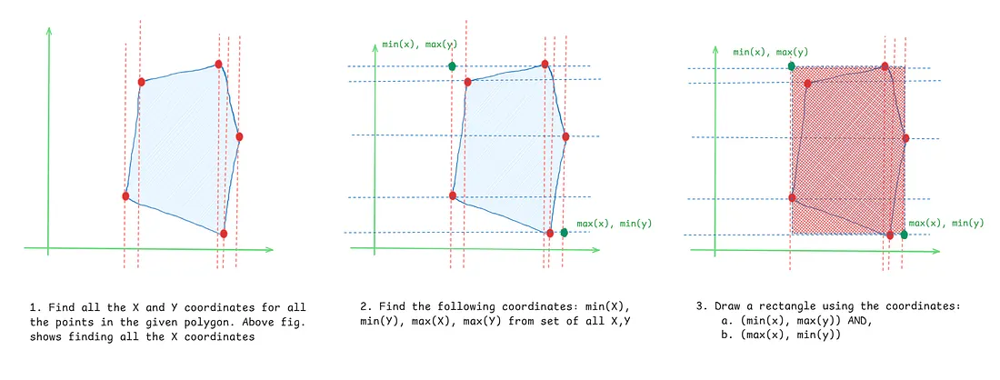
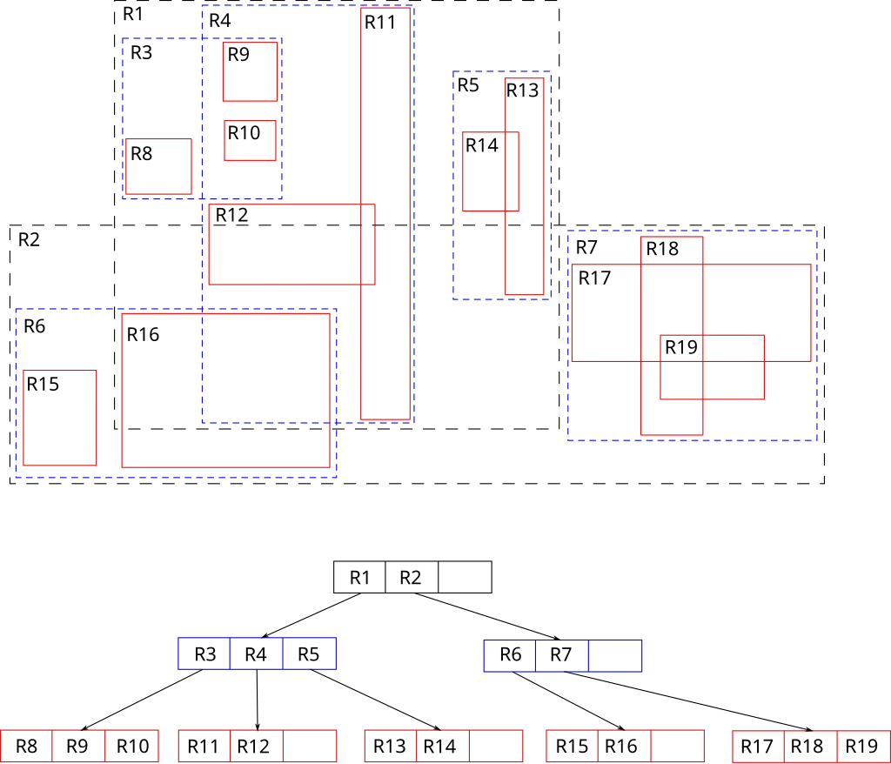
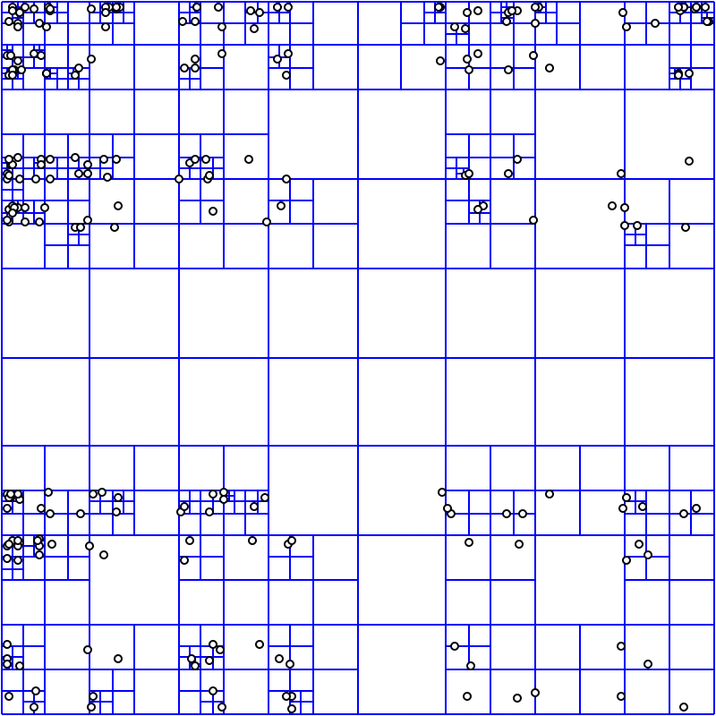
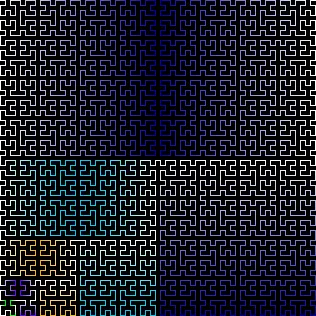
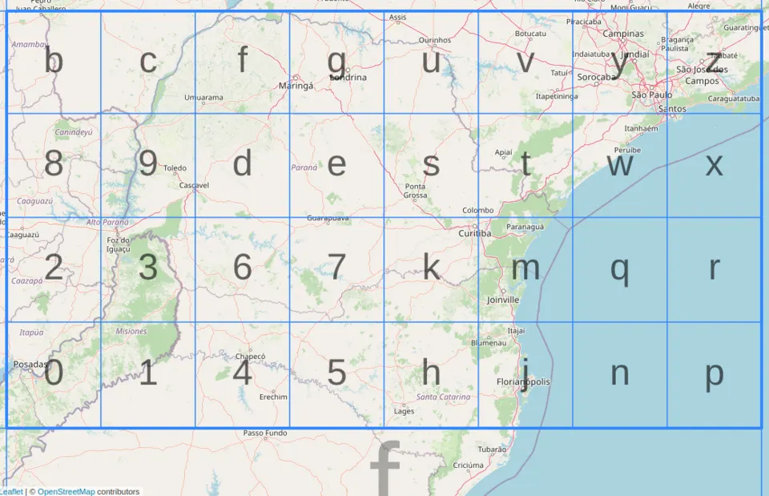

Ever thought how Uber finds cabs near you or how Google Maps suggests restaurants within 2 kilometre radius of your location ? I will try to cover the core ideas addressing these computational problems, often referring to the abstract mathematical topics that make them possible.

Note : This is not going to be a conventional, tutorial-style kind of blog. I have included several references, because I simply believe they will explain the theoretical parts better than I ever could. My goal is simply to connect the dots and help you reach your “aha” moment. A little knowledge of core database concepts such as B-trees and Binary trees would be helpful.

Let's get straight to the point — given the world’s map how would you store it ? (And yes, for this exercise, we’re not entertaining the flat Earth theory, lol.) We will dive deeper into all the major data structures that make these possible. So let’s begin!

## R Trees

Before we get into the details of R trees we need to understand what is meant by a Minimum Bounding Rectangle, or simply a MBR. A MBR is defined as the smallest rectangle (aligned to the axes) that completely encloses a spatial object — such as a point, line, polygon, or even a set of objects

Finding MBR for a polygon

Now a knowledge of what a B-tree (more specifically a B+ tree) is would be immensely helpful. Here is a quick guide for [B trees 🔗](https://youtu.be/K1a2Bk8NrYQ).

R trees are the B+ trees for MBRs. Let me break it down for you : Imagine starting with a very large minimum bounding rectangle (MBR) — one that covers a significant part (or even all) of the polygons in your dataset. This bounding rectangle becomes the root node of an R-tree and contains several child nodes.

Each child node is itself a smaller bounding rectangle, nested within the root, and each of these can in turn be a parent to more rectangles contained within them. Think of this as a hierarchy of bounding regions, where each level stores spatial objects grouped inside successively smaller rectangles.

A distinctive feature of R-trees compared to B+ trees is that in R-trees, the bounding rectangles (MBRs) for sibling nodes can overlap — there’s no strict separation as in B+ trees, where each range is completely partitioned and never overlaps.

This overlap means that when searching, a polygon might be covered by more than one bounding rectangle, so the search may sometimes need to follow multiple paths. For example, look at the overlap between R3 and R4 in the following example.

By Skinkie, w:en:Radim Baca — Own work, Public Domain, [Wikimedia Commons](https://commons.wikimedia.org/w/index.php?curid=9938400)

You can further read the original paper by A. Guttman here : [paper link 🔗](https://dl.acm.org/doi/10.1145/602259.602266) . PostGIS implements GIST (a custom spatial indexing structure) which is very similar to R-trees.

## Quadtrees

Think of them as simple extension of the Cartesian Coordinate system. Divide the earth into grids where every individual grid cell would have its own unique identity. But how many grids to use — 4x4, 40x40 or 400x400 ?

Quadtrees offer an elegant solution through adaptive, recursive subdivision. Instead of using a fixed grid size, they dynamically adjust based on data density. This density is referred as load factor (X), this could be the number of users in a particular region, the number of active Uber drivers, or the count of restaurants within a quadrant.

Here’s the recursive process:

1. Start with the entire map as one large quadrant
2. Check the load factor for that quadrant
3. If the load factor exceeds a predefined threshold, divide the quadrant into 4 smaller sub-quadrants
4. Repeat this process for each new sub-quadrant until every quadrant satisfies:

> Load Factor ≤ Maximum Threshold for all quadrants

By David Eppstein — self-made; originally for a talk at the 21st ACM Symp. on Computational Geometry, Pisa, June 2005, Public Domain, [Wikimedia Commons](https://commons.wikimedia.org/w/index.php?curid=2489019)

Areas with higher load factor have higher density of grid cells. Areas with lower load have a lower density of grid cells. I believe the best way to learn this would be to get your hands dirty with writing some code (or atleast binge watching, I know you are lazy 😃) : [Code Your Own Quadtree 🔗](https://youtu.be/OJxEcs0w_kE) or you might like the [Animated Quadtrees using p5.js 🔗](https://youtu.be/OJxEcs0w_kE)

## Hilbert Curves

The Hilbert curve was first described back in 1891 by David Hilbert. It is a space-filling curve, which means it is a 1D curve that passes through every point in a 2D space — technically, it’s an example of a mathematical fractal. Fractals ? Ever thought about fractional dimensions ? No! Right, cause we are sane humans and who would think that. Here is a crisp explanation for fractals (not really helpful for this article though) : [Fractals Explained🔗](https://youtu.be/gB9n2gHsHN4) .

By Enormator — File:Hilbert.png, CC BY-SA 3.0, [Wikimedia Commons](https://commons.wikimedia.org/w/index.php?curid=149101004)

Now why even use these curves ? The reason is all the data structures we have seen already have poor performance for queries like : “Hey Google! find Indian restaurants near me”. Technically called range queries. Hilbert curve squishes the 2D map we have into a 1D line, such that points nearby in the map would also end up being closer on the line — in other words it preserves spatial locality. And it does so in an efficient manner. Doing range queries on a 1D line is a child’s play.

It’s just like picking a set of numbers that are close together on a number line. To look into details of how we exactly do this refer to the following resource: [Hilbert Curves Explained 🔗](https://youtu.be/3sNyK2qK3rQ)

Hilbert curves aren’t themselves any data structure, they are used for mapping locations. Hilbert Curves are often combined with other structures like R-trees. [Coding Hilbert Curves with p5.js 🔗](https://youtu.be/dSK-MWQu7Fk)

## GeoHashing

GeoHash are similar to quadtrees as they divide the earth into grid. But they do so evenly — 32x32 grid. And each cell is further divided into a 32x32 grid. The position of a cell is assigned with an alphanumeric character. So the number of character defines the level of nested cell we use. Also, as you might guess from the name hash, they are extremely fast for lookups. Geohashes are quite simple to implement, however they work only for point data and not spatial objects like lines or polygons.

Databases like MongoDB and Elasticsearch rely on geohash for fast lookups and searching for nearby point. [Geohash tutorial 🔗](https://youtu.be/ua4KkN6gG0U) .

By Krauss — Own work, CC BY-SA 4.0, [Wikimedia Commons](https://commons.wikimedia.org/w/index.php?curid=128655268)

## Modern Spatial Indexing Libraries

The article would be incomplete without talking about how Google and Uber actually scale to billions of devices. You might ask reasonably at this point why aren’t all the other classic data structures we discussed enough ?

Take R-trees, for example. While they are powerful for dynamic and multi-shape geometry searches in traditional GIS systems, they have a few key drawbacks when it comes to global-scale, cloud-native applications:

* Distributed scaling: Tree structures are tricky to partition or shard efficiently across thousands of servers, in other words they don’t scale horizontally.
* Point lookup speed: For billions of points, grid/cell lookups are often orders of magnitude faster.

This is where modern indexing libraries like Uber’s H3 and Google’s S2 come in. Both take a “divide the earth into cells” approach, but do so in a way that is globally accurate and ready for the cloud:

* <mark>H3 (Uber)</mark>: Uses hexagonal hierarchies, giving cells with consistent neighbor relationships. Perfect for heatmaps, coverage, and fast range queries at internet scale.
* <mark>S2 (Google)</mark>: Maps the earth onto a cube (and then a sphere), recursively subdividing it into “spherical quads.” Optimized for keeping cell sizes consistent worldwide and for hierarchical queries over vast datasets.

Also note that these libraries take into account the spherical nature of earth. A simple grid structure like quadtree generates distorted cells as we move towards the poles. These libraries are more useful for point data. These libraries are available as extensions to popular databases like Postgres, MongoDB, CockroachDB, etc,.

So this is where I would wrap up this article. A lot to swallow, I know, but hey! Now you can think more concretely when designing a fun-to-use software with vast spatial data to store. Please give a like to this article and make sure to follow me back. See you soon 😃!!
